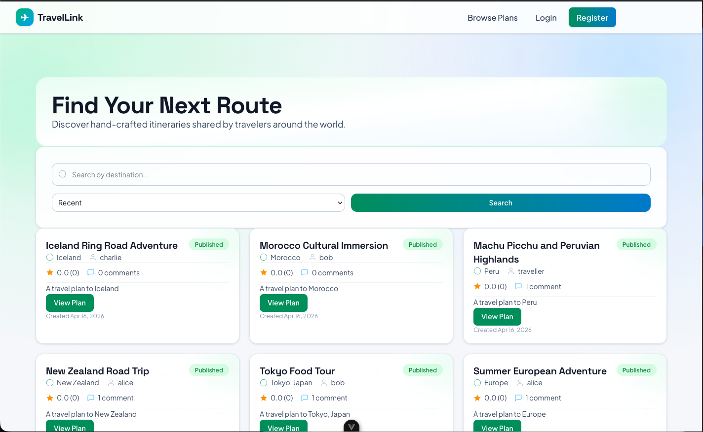
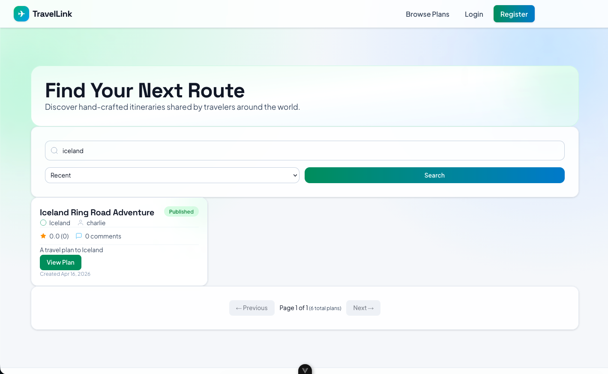
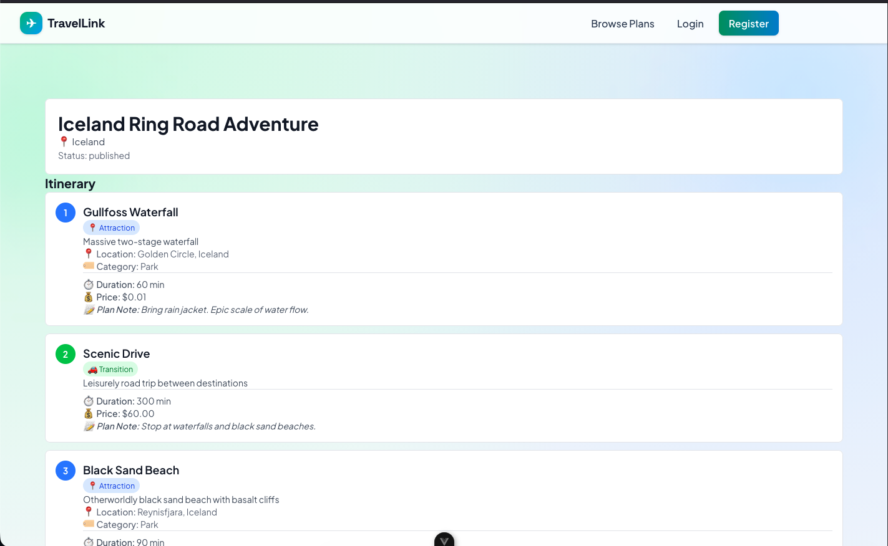
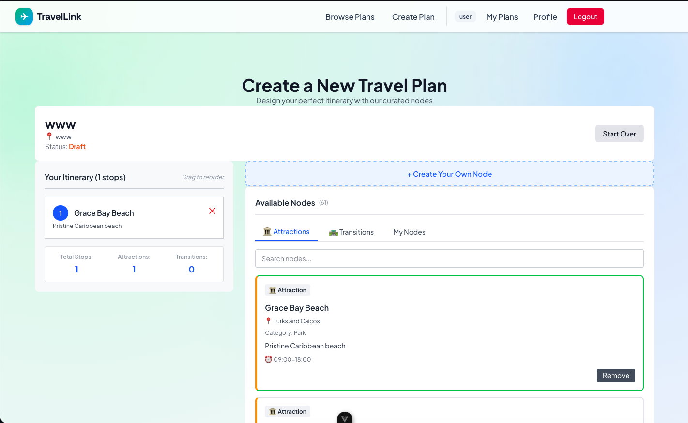
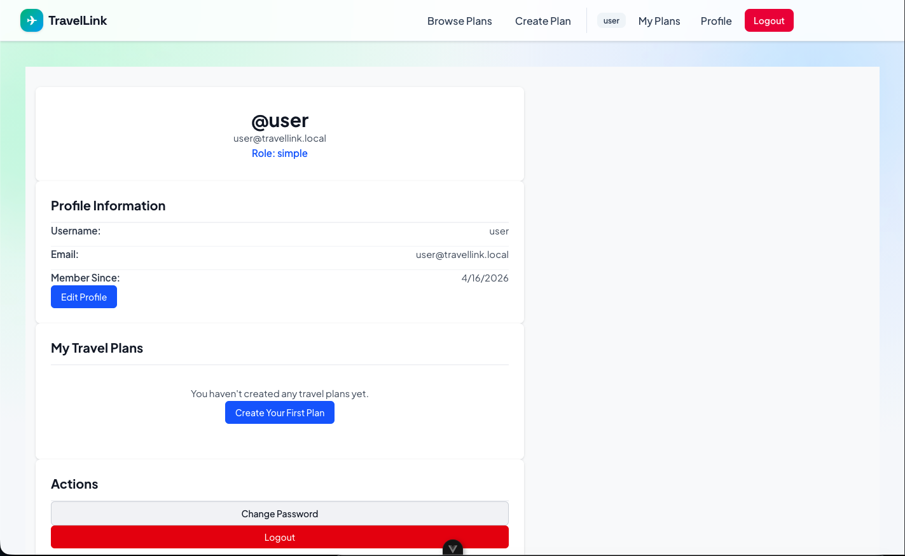

# TravelLink

TravelLink is a collaborative travel planning application that enables users to create, share, and discover travel itineraries built as linked lists of travel nodes. Users can chain together attractions and transitions to build complete travel plans, then share them with a community for feedback, ratings, and comments.

## Table of Contents

- [Project Description](#project-description)
- [Screenshots](#screenshots)
- [System Architecture](#system-architecture)
- [User Roles and Permissions](#user-roles-and-permissions)
- [Technology Stack](#technology-stack)
- [Installation and Setup](#installation-and-setup)
- [Running the System](#running-the-system)
- [Seeded Data](#seeded-data)
- [Project Structure](#project-structure)
- [API Documentation](#api-documentation)
- [Development](#development)

## Project Description

TravelLink is a full-stack web application that allows travelers to:

- Browse and search published travel plans by destination or keyword
- Create custom travel itineraries by linking attraction nodes (restaurants, hotels, museums) with transition nodes (walking, driving, public transit)
- Share their travel plans with the community
- Rate and comment on other users' travel plans
- Request promotion from Simple User to Traveller status to unlock content creation features
- Manage their travel plans and profile information

The platform uses a linked list data structure to represent travel itineraries, where each plan consists of nodes connected in sequence. This structure allows flexible routing and easy navigation between different travel destinations and points of interest.

### Core Features

- User authentication with role-based access control
- Travel plan creation and management
- Attraction and transition node library
- Plan discovery and search functionality
- Community engagement through ratings and comments
- Admin moderation capabilities
- User promotion workflow

## Screenshots

### Browse Page
Browse and discover travel plans shared by the community with search and filtering capabilities.



### Search Results
Search travel plans by destination and view paginated results with ratings and comments.



### Plan Detail View
View complete travel itineraries with linked nodes (attractions and transitions) displayed in sequence.



### Create Travel Plan
Create new travel plans by selecting and arranging nodes to build custom itineraries.



### User Profile
Manage your profile, view your travel plans, and access account settings.



## System Architecture

## User Roles and Permissions

TravelLink has three user roles with different capabilities:

### Simple User

A basic user who can browse and engage with content but cannot create plans.

**Permissions:**
- Browse published travel plans
- Search travel plans by destination or keyword
- View plan details and linked nodes
- Read comments and ratings
- Submit ratings (1-5 stars) to plans
- Leave comments on plans
- View public user profiles
- Submit promotion request to become a Traveller

**Restrictions:**
- Cannot create travel plans
- Cannot create new nodes
- Cannot delete or edit plans
- Cannot access admin features

### Traveller

An elevated user who can create and manage travel plans and nodes.

**Permissions:**
- All Simple User permissions
- Create new travel plans (draft or published)
- Add existing nodes to plans
- Create new attraction nodes (pending admin approval)
- Create new transition nodes (pending admin approval)
- Edit their own travel plans
- Delete their own travel plans
- Publish draft plans
- View their own profile with plan statistics

**Restrictions:**
- Cannot delete or edit other users' plans
- Cannot approve nodes created by others
- Cannot access admin features
- Cannot access moderation tools

### Admin

An administrator with full platform control.

**Permissions:**
- All Traveller permissions
- View all user accounts and profiles
- Approve or reject new nodes for public visibility
- Suspend or unsuspend travel plans
- Delete travel plans (hard delete)
- Delete user comments
- View moderation dashboard
- Approve or reject user promotion requests
- Manage user roles
- View platform analytics

**Restrictions:**
- None

## Technology Stack

### Backend

- **Language**: Go 1.x
- **Web Framework**: Gin (routing, middleware, HTTP handling)
- **Database**: SQLite3 with github.com/mattn/go-sqlite3 driver
- **ORM**: GORM (database abstraction, migrations)
- **Authentication**: JWT with golang-jwt/jwt
- **Hashing**: bcrypt for password storage
- **UUID Generation**: google/uuid
- **HTTP Server**: Built-in net/http (wrapped by Gin)

### Frontend

- **Framework**: Vue 3 with Composition API
- **Language**: TypeScript
- **Build Tool**: Vite (fast development and production builds)
- **HTTP Client**: Axios for API requests
- **State Management**: Pinia (Vue store)
- **Routing**: Vue Router
- **Styling**: TailwindCSS for utility-first styling
- **Package Manager**: npm

### Database

- **Type**: SQLite3 (embedded, file-based)
- **Location**: backend/travellink.db
- **Migrations**: File-based migrations in backend/internal/database/migrations/
- **Access**: GORM with SQLite3 driver
- **No external database server required**: Single-file deployment

### Development & Testing

- **Backend Testing**: Go's built-in testing package with testify assertions
- **Frontend Testing**: Vitest for unit tests
- **API Testing**: REST client (Thunder Client, Postman)
- **Version Control**: Git
- **Documentation**: Markdown-based specs and API contracts

## Installation and Setup

### Prerequisites

- Go 1.20 or higher
- Node.js 18+ and npm
- Git
- Code editor (VS Code recommended)

### Step 1: Clone the Repository

```bash
git clone https://github.com/opxz7148/TravelLink-List.git
cd TravelLink-List
```

### Step 2: Backend Setup

Navigate to backend directory:

```bash
cd backend
```

Install Go dependencies:

```bash
go mod download
```

This downloads all required Go packages including Gin, GORM, and SQLite3 driver.

### Step 3: Frontend Setup

Navigate to frontend directory (from root):

```bash
cd frontend
```

Install Node dependencies:

```bash
npm install
```

This installs Vue 3, Vite, TypeScript, TailwindCSS, and other frontend packages.

### Step 4: Database Initialization

When the backend starts for the first time, it automatically:

1. Creates the SQLite3 database file (travellink.db)
2. Runs all migrations to create tables
3. Seeds sample data (7 users, 10 travel plans, 101 nodes, 5 ratings, 5 comments)

No manual database setup needed.

### Step 5: Environment Configuration

Backend environment variables are optional. Default configuration:

- API Port: 8000
- Database Path: backend/travellink.db
- JWT Secret: generated at startup if not specified

## Running the System

### Start Backend API

From the `backend` directory:

```bash
go run ./cmd/api/main.go
```

Or build as binary:

```bash
go build -o api ./cmd/api/main.go
./api
```

Backend will start on `http://localhost:8000`

You should see:

```
[GIN-debug] Loaded HTML Templates
[GIN-debug] Listening and serving HTTP on :8000
```

### Start Frontend Development Server

From the `frontend` directory:

```bash
npm run dev
```

Frontend will start on `http://localhost:5173`

You should see:

```
  VITE v7.3.1  ready in xxx ms

  Local:    http://localhost:5173/
```

### Production Build

Build frontend for production:

```bash
npm run build
```

Output appears in `frontend/dist/` directory.

Build backend for production:

```bash
go build -o travellink-api ./cmd/api/main.go
```

### System Verification

Once both services are running:

1. Open http://localhost:5173 in your browser
2. Frontend should load without errors
3. You should see the homepage with available travel plans
4. Try browsing plans, searching by destination
5. Create account to test user flows

## Seeded Data

### Automatic Seeding

When you start the application with an **empty database**, sample users and travel plans are automatically created for testing and development.

### Seeded Users

| Username | Email | Password | Role | Bio |
|----------|-------|----------|------|-----|
| `admin` | admin@travellink.local | AdminPass123! | Admin | System administrator |
| `traveller` | traveller@travellink.local | TravellerPass123! | Traveller | Loves exploring new places |
| `user` | user@travellink.local | UserPass123! | Simple | Just browsing travel plans |
| `alice` | alice@travellink.local | AlicePass123! | Traveller | Adventure seeker and photographer |
| `bob` | bob@travellink.local | BobPass123! | Traveller | Cultural explorer |
| `charlie` | charlie@travellink.local | CharliePass123! | Simple | Beach and nature lover |

**Role Capabilities:**
- **Admin**: Full system access, user management, content moderation, promotion request review
- **Traveller**: Create and publish travel plans, add/edit nodes, rate/comment on plans, submit for promotion
- **Simple**: Browse and view published plans, rate/comment (limited creation rights)

**Password Hashing**:
All passwords are securely hashed using bcrypt with default cost factor (10 iterations) during seeding. Passwords are logged in startup logs for reference but never stored in plaintext.

### Seeded Travel Plans

**Published Plans (6 total):**

| Title | Destination | Author | Description |
|-------|-------------|--------|-------------|
| Summer European Adventure | Europe | alice | 3-week itinerary covering Paris, Rome, and Barcelona |
| Tokyo Food Tour | Tokyo, Japan | bob | Culinary journey through traditional and modern cuisine |
| New Zealand Road Trip | New Zealand | alice | Epic road trip around both islands with outdoor activities |
| Machu Picchu and Peruvian Highlands | Peru | traveller | Trek through Andes and explore ancient Inca ruins |
| Morocco Cultural Immersion | Morocco | bob | Markets, deserts, and mountain villages exploration |
| Iceland Ring Road Adventure | Iceland | charlie | Complete circle around Iceland with waterfalls and geysers |

**Draft Plans (4 total):**

| Title | Destination | Author | Description |
|-------|-------------|--------|-------------|
| Budget Southeast Asia Backpacking | Southeast Asia | charlie | Affordable route through Thailand, Vietnam, Cambodia |
| Caribbean Island Hopping | Caribbean | bob | Multiple islands for beaches, diving, and paradise |
| Norway Fjords Road Trip | Norway | alice | Scenic drive with hiking and photography opportunities |
| India Taj Mahal and Beyond | India | traveller | From Taj Mahal to Kerala backwaters cultural heritage |

**Plan Status Explanation:**
- **Published**: Visible to all users on the browse page, can be rated and commented on
- **Draft**: Only visible to plan creator, not listed publicly

**Note**: Seeding only happens when the database is empty. If users already exist, seeding is skipped automatically.

### Testing with Seeded Users

After starting the application, you can immediately test endpoints with the seeded credentials:

```bash
# Login as alice (traveller with published plans)
curl -X POST http://localhost:8000/api/v1/auth/login \
  -H "Content-Type: application/json" \
  -d '{
    "email": "alice@travellink.local",
    "password": "AlicePass123!"
  }'

# Response includes JWT token
{
  "success": true,
  "data": {
    "access_token": "eyJhbGc...",
    "token_type": "Bearer",
    "expires_in": 3600
  }
}
```

#### Test Scenarios with Seeded Data

Browse published plans:
```bash
curl -X GET http://localhost:8000/api/v1/plans
```

View alice's published plans:
```bash
curl -X GET http://localhost:8000/api/v1/plans/search?q=alice
```

View plan details:
```bash
curl -X GET http://localhost:8000/api/v1/plans/{plan-id}
```

Create a new plan (requires authentication):
```bash
curl -X POST http://localhost:8000/api/v1/plans \
  -H "Authorization: Bearer <access_token>" \
  -H "Content-Type: application/json" \
  -d '{
    "title": "My Custom Plan",
    "destination": "Thailand",
    "nodes": []
  }'
```

### Resetting the Database

To reset and re-seed the database:

```bash
# SQLite - removes database and WAL files
rm -f backend/travellink.db backend/travellink.db-shm backend/travellink.db-wal

# Then restart the application
go run ./cmd/api/main.go
```

### Troubleshooting: UNIQUE constraint failed: schema_migrations.version

**Error Message:**
```
UNIQUE constraint failed: schema_migrations.version
failed to run database migrations: failed to apply migration NNN: failed to record migration
```

**Cause:**
This occurs when a migration was partially applied (schema change executed but record insertion failed), causing the migration version to be marked as applied when it actually failed. Subsequent runs attempt to re-apply the same migration but the version already exists.

**Solution:**
Delete the database files to force a clean migration run:

```bash
cd backend
rm -f travellink.db travellink.db-shm travellink.db-wal
go run ./cmd/api/main.go
```

**Prevention:**
Migrations now use atomic transactions (since this fix) - both the schema change AND the migration record are committed together, or both are rolled back on failure. This prevents incomplete migration states.

## Project Structure

```
TravelLink-List/
├── backend/
│   ├── cmd/
│   │   └── api/
│   │       └── main.go              # Application entry point
│   ├── internal/
│   │   ├── controllers/             # HTTP handlers
│   │   ├── middleware/              # Auth, validation, error handling
│   │   ├── services/                # Business logic
│   │   ├── models/                  # Domain entities
│   │   ├── repositories/            # Data access layer
│   │   └── database/                # Database and migrations
│   ├── go.mod                       # Go dependencies
│   ├── Makefile                     # Build commands
│   └── README.md                    # Backend documentation
│
├── frontend/
│   ├── src/
│   │   ├── components/              # Reusable Vue components
│   │   ├── pages/                   # Page components
│   │   ├── services/                # API service layer
│   │   ├── stores/                  # Pinia state management
│   │   ├── router/                  # Vue Router configuration
│   │   ├── App.vue                  # Root component
│   │   └── main.ts                  # Frontend entry point
│   ├── package.json                 # Frontend dependencies
│   ├── vite.config.ts               # Vite configuration
│   ├── tsconfig.json                # TypeScript configuration
│   └── README.md                    # Frontend documentation
│
├── specs/
│   └── 001-travel-linked-list/
│       ├── spec.md                  # Feature specification
│       ├── plan.md                  # Implementation plan
│       ├── data-model.md            # Data model documentation
│       ├── quickstart.md            # Developer quickstart
│       └── contracts/               # API contracts
│
└── README.md                        # This file
```

## API Documentation

### Base URL

```
http://localhost:8000/api/v1
```

### Authentication

Include JWT token in Authorization header:

```
Authorization: Bearer <your_jwt_token>
```

### Main Endpoints

**Authentication**:
- POST /auth/register - Create new account
- POST /auth/login - User login
- GET /auth/refresh - Refresh JWT token

**Travel Plans**:
- GET /plans - Browse published plans (paginated)
- GET /plans/search - Search plans by keyword
- POST /plans - Create new plan (Traveller only)
- GET /plans/:id - Get plan details
- PATCH /plans/:id - Update plan (owner only)
- DELETE /plans/:id - Delete plan (owner only)
- PATCH /plans/:id/publish - Publish draft plan

**Nodes**:
- GET /nodes - List available nodes
- POST /nodes - Create new node (Traveller only)
- GET /nodes/:id - Get node details
- PATCH /nodes/:id/approve - Approve node (Admin only)

**Comments**:
- GET /plans/:id/comments - List plan comments
- POST /plans/:id/comments - Add comment
- DELETE /comments/:id - Delete comment (owner only)

**Ratings**:
- POST /plans/:id/ratings - Rate a plan (1-5)
- PATCH /plans/:id/ratings - Update user's rating

**Users**:
- GET /users/:id - Get user profile
- GET /users/me - Get current user profile
- PATCH /users/me - Update profile

See API contracts in `specs/001-travel-linked-list/contracts/` for request/response schemas.

## Development

### Running Tests

Backend unit tests:

```bash
cd backend
go test ./...
```

Frontend unit tests:

```bash
cd frontend
npm run test
```

### Code Organization

- Backend follows layered architecture pattern
- Frontend uses Vue 3 Composition API
- All API endpoints defined with OpenAPI contracts
- Database changes use migrations

### Common Tasks

Create new migration:

```bash
cd backend/internal/database/migrations
touch 999_create_new_table.sql
```

Build and run backend:

```bash
cd backend
go build -o api ./cmd/api/main.go
./api
```

Build frontend:

```bash
cd frontend
npm run build
```

## System Screenshots

Note: Screenshots will be added to document the user interface. Key screens include:

- Browse Plans Page: Shows paginated list of travel plans with sorting options (Recent, Most Popular, Highest Rated)
- Plan Details Page: Displays complete travel itinerary with linked nodes in sequence
- Search Results Page: Found plans matching user search criteria
- Create Plan Page: Form to create new travel plan and select nodes
- User Profile Page: User information and their created plans

## Troubleshooting

### Port Already in Use

If port 8000 is in use:

```bash
# Find process using port 8000
lsof -i :8000

# Kill the process
kill -9 <PID>
```

### Database Locked

Delete the database and restart to rebuild:

```bash
rm backend/travellink.db
go run ./cmd/api/main.go
```

### Frontend Can't Connect to API

Ensure backend is running on port 8000 and check browser console for CORS errors. Frontend should connect to http://localhost:8000 automatically.

### Dependencies Issues

Clear and reinstall:

```bash
# Backend
cd backend
go clean -modcache
go mod download

# Frontend
cd frontend
rm -rf node_modules package-lock.json
npm install
```